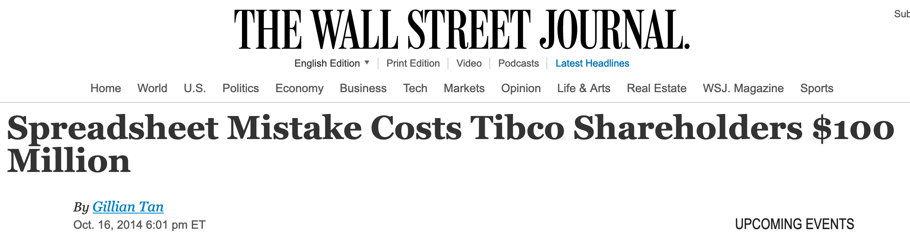
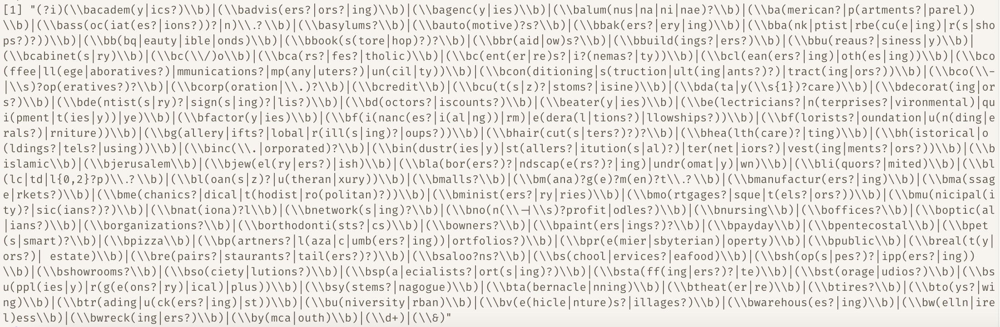

```{r setup, include=FALSE}
knitr::opts_chunk$set(echo = FALSE)
```

## Examining VA evictions

Team:

- RVA Eviction Lab (VCU): Benjamin Teresa; Connor White; Kathryn Howell
- UVA: Barbara Wilson; Michael Salgueiro; Michele Claibourn

(Some) end goals of the work:

- Housing Justice Atlas (eviction densities; frequent plaintiffs; etc.)
- Cleaned, well-structured case data(base)

## The data

VA court filings are public---but hand-downloading 1000s of them isn't plausible

Ben Schoenfeld (virginiacourtdata.org) built a tool to scrape them from every VA district civil court's website

We begin there: Unprocessed, raw data gathered from court websites

## Cursed data

In their raw form, administrative data like court records are rife with issues, e.g.:

- Duplicate entries
- Serial cases
- Entry issues (e.g., "ZIP = 00000")
- Inconsistencies (e.g., "XYZ L.L.C." vs. "XYZ LLC")

Data cleaning is thoroughly necessary

The VCU group has been taking chunks of data, cleaning them, and writing up reports for a while...

So: Why are us interlopers useful?

## Unholy Excel

The process for cleaning these data that was in place prior to this summer was a set of point-and-click procedures (e.g., Excel GUI)

But that sort of procedure is *difficult to reproduce* and *error-prone*

It relies on a fragile combination of user memory and note-taking

"Spreadsheets: A dystopian moonscape of unrecorded user actions" - Gordon Shotwell

## No, really; "Excel-ing it" is a risk
<br>
<br>
<br>
{width=100%}

## Solution

Put every process in code

That's what I began with this summer

- Take the raw data collected by the scraper
- Learn what cleaning steps the RVA Eviction Lab considered appropriate
- Add to and refine those steps
- Put it all in code that's *reproducible*[1], *generalizable*[2] and *automatable*[3]

[1] Eliminate future guesswork! Every decision is transparent<br>
[2] Code works just as well with 2020 data as with 2021 data as with...<br>
[3] Reduced data-cleaning process from hours of clicking to clicking "RUN ALL" once

## Having fun's not hard when you've got ~~a library card~~ carefully maintained code

Not only does working in code avoid reproducibility problems, it also expands the range of ways we can clean and analyze data

For example: We're primarily interested in evictions of *residential defendants*---people being kicked out of their homes

But with 1000s and 1000s of cases, how do we identify defendants who are individuals vs. non-human entities?

## Solution

Write a general pattern of strings indicative of non-residential defendants, and use your programming language of choice to iterate a search for those strings over defendant name(s)

E.g., our pattern for flagging non-residential defendants:
{width=100%}

Takes time to write up-front but saves hours of manual searching and/or pointing-and-clicking down the line

## End result

We go from:

- Sprawling data files and folders, each requiring manual interaction to clean and analyze
- Low reproducibility of cleaning/analysis process
- High risk of error over time

To:

- One folder containing code and data for the whole project
- High reproducibility/low error risk
- Ability to add any data we want cleaned and analyzed, hit "run," and step back
- Exports of cleaned data and dynamically generated tables/maps, for example...

## Auto-exported interactive tables

- To get an overview of evictions by-court, we dynamically generate tables
  - (Requiring no manual effort beyond the initial code-writing!)
- Automatically update upon addition of new data

- https://virginiaequitycenter.github.io/va-evictions/

## And, quickly: Trends of interest for Cville + RVA regions

- https://virginiaequitycenter.github.io/va-evictions/cville-rva-update.html