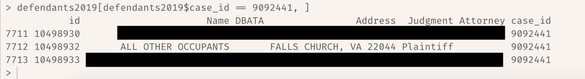

```{r setup, include=FALSE}
knitr::opts_chunk$set(echo = TRUE)
```

This past week, I continued working with Virginia court data as part of our project looking at evictions in the state. 

A major focus this week was making efficiency updates to our cleaning/aggregation code. As my initial code grew and grew, the computational drag was becoming a problem: My machine was taking around 20 minutes to run all of the necessary functions. So, I stripped away some unnecessary (or relocatable) code and tried to do a bit of vectorization. The time the code takes has been reduced from ~20 to ~3 minutes.

I also eliminated some code redundancies to minimize the amount of changes that would be required if, say, we get access to additional years of court data at some point. More specifically: Wherever I had referred to data from multiple years via separate code statements, I rewrote the code to apply the relevant functions to objects for all of the years of interest, with those years determined by a single `data_years` vector established right at the top of the code. For example:
```{r, eval = F}
defendants2019 <- aggregator(defendants2019)
defendants2020 <- aggregator(defendants2020)
defendants2021 <- aggregator(defendants2021)
plaintiffs2019 <- aggregator(plaintiffs2019)
plaintiffs2020 <- aggregator(plaintiffs2020)
# ... and so on
```
Became:
```{r, eval = F}
court_dat_objects <- c(sapply(c('defendants', 'plaintiffs', 'hearings'), function(x) paste0(x, data_years)))
for (i in 1:length(court_dat_objects)) {
  assign(court_dat_objects[i], aggregator(x = eval(parse(text = court_dat_objects[i])),
                                          year = stri_extract(court_dat_objects[i], regex = '(\\d{4})'),
                                          what = stri_extract(court_dat_objects[i], regex = '(\\D+)')))
}
```
Where `data_years` is a simple vector that can be modified as desired right at the top of the file. (E.g., `c(2019, 2020, 2021)`.)

Accordingly, if we get our hands on, say, 2022 data files down the line, the code will clean them as well (once they're in the relevant directory) with very little additional user effort. 

---

As part of this project, we're hoping to separate eviction filings against commercial defendants from filings against residential defendants. (The primary focus of the project is people who are getting kicked out of their *homes*.) I began putting together a dictionary of regex terms that we can use to comb through the data and tag likely commercial defendants. What I have so far is below.

In the following code, every element of `want_to_tag` is an example of a commercial defendant that I'd like to identify as such. Every element of `dont_want_to_tag` is an example of a *non-*commercial defendant that I don't want to tag, but who has a name that might be caught up by commercial regex search terms: Steve **Corp**ano, Susan **Auto**sky, **Car**men Diaz, Jen R**inc**ky. I've written a draft regex search pattern such that it will tag the commercial defendants but not the people whose names might just accidentally flag them (this is mostly achieved via the use of word-break searches).
```{r, eval = T}
# Regex dictionary for commercial defendant searches
library(stringi)

want_to_tag <- c('supreme vacuums llc',
                 'moderate vacuums LLC.',
                 'Stock CORP.',
                 'Only Subprime Credit Default Swaps Corp',
                 'wall st coRpoRatIon',
                 'Self-indulgent FouNDatIon',
                 'Some Wealthy tRUst',
                 'Ohio State University, The',
                 'E=MC-squared CoLLege',
                 'Western High SchOOl',
                 'Caloric PiZZa',
                 'Discount AUTOs',
                 'troublingly cheap mediCAL supplies',
                 'chipped-tooth dENtistry',
                 'Some, But Not All, SERviCEs',
                 '101 barber',
                 'hermes sALon',
                 'Downtown Books',
                 'Not-A-Front Laundry',
                 'Suit-and-Tie Financial',
                 'BANK OF VIRGINIA',
                 'CREDIT UNION of the OZARKS',
                 'Things Fall Apart ConTraCTInG',
                 'OVER-THE-ESTIMATE CONTRACTORS',
                 'Quik Loan',
                 'PayDayLoanZ',
                 'Cars 4 Less',
                 'Take A Car, Leave A Car',
                 'Morgan & Morgan & Morgan & Morgan & Morgan Law Firm',
                 '101 Haircuts',
                 '10 Fathoms Deep Marine Outfitters',
                 'Ink, inc.')

dont_want_to_tag <- c('Steve Corpano',
                      'Susan Autosky',
                      'Carmen Diaz',
                      'Jen Rincky')

defs <- data.frame(defendant = c(want_to_tag, dont_want_to_tag))

matched <- stri_detect(defs$defendant, regex = '(?i)(\\bllc)|(\\bfoundation)|(\\btrust)|(\\bcollege)|(\\buniversity)|(\\bschool)|(\\bpizza)|(\\bmedical)|(\\bdoctor)|(\\bdentist)|(\\bservice)|(\\bbarber)|(\\bsalon)|(\\bbooks)|(\\blaundry)|(\\bfinancial)|(\\bbank)|(\\bcredit)|(\\bloan)|(\\bpayday)|(\\bindustries)|(\\bcontractor)|(\\bcontracting)|(\\bcars?\\b)|(\\bcorp\\.?\\b)|(\\bcorporation)|(\\bautos?\\b)|(\\bfirm\\b)|(\\d+)|(\\binc\\.?\\b)')

# Who is the regex pattern *not* matching?
defs$defendant[!matched]
```

We got this idea of trying to identify commercial defendants from the Princeton Eviction Lab's methodology report, and we're now in contact with them to try and cross-reference our search terms with theirs. I'm sure there are additional terms we haven't thought of that it'd be wise to include. (Speaking of, if anyone has ideas for additions, please let me know!)

---

This coming week, I'm planning to:

1. Resolve lingering issues in the data regarding duplicate and serial case filings
2. Work on sorting out how to identify who is legally "defendant #1" in cases where multiple defendants are listed
    - It seems like the row-order of defendants in our data may not be the legal order
    - For example: As shown below, there are technically three defendants for case #9092441 (I've blinded the names of the first- and third-listed defendants for privacy)
    - Presumably, "all other occupants" is, legally, the *last* defendant ("John Smith, Jane Doe, and All Other Occupants"), but it's listed second in our data, and the `id` value for "all other occupants" is between the `id` values for the other two defendants (who are, presumably, the first and second defendants legally)
    - This may or may not be an issue going forward, but I'd like to see what I can learn about why this is the case

