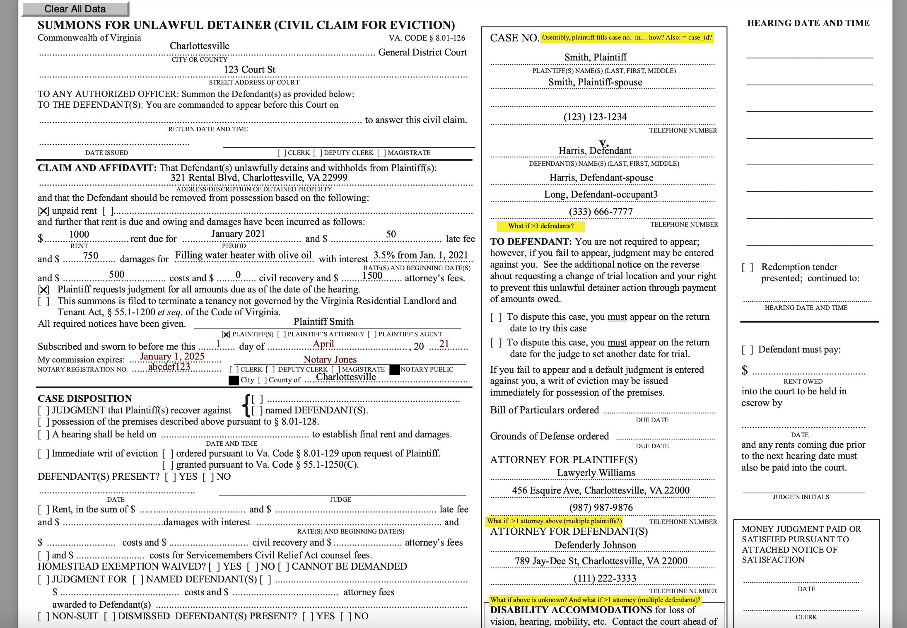

```{r setup, include=FALSE}
knitr::opts_chunk$set(echo = TRUE)
```

This past week, I continued working to clean up the court data we're using for the housing justice project. We continue to encounter interesting discrepancies between the numbers we calculate and those previously found by collaborators using ostensibly the same data. Resolving those (a) takes some time in and of itself and (b) creates opportunities to refine the data cleaning process. I've been working with Connor White, an analyst working with our VCU collaborators, to resolve these discrepancies, and we're certainly getting closer to having clean, fully prepped data.

The lingering discrepancies are primarily in:
- The numbers of true (i.e., errant) duplicate court cases in the data for each year of interesr
- The numbers of serial court cases (i.e., repeat filings) in the data for each year of interest

We're looking to recreate in reproducible code what our collaborators had previously done in Excel/SPSS GUIs, and we've so far landed on the following two functions to tag and remove true duplicates and serial cases:

```{r, echo = T, eval = F}
# True duplicates
deduplicater <- function(x) {
  orig_nrow <- nrow(x)
  dupes <- x[, c('FiledDate', 'Judgment', 'Costs', 'AttorneyFees', 'PrincipalAmount', 'OtherAmount', 'pla_1', 'def_1', 'def_1_zip')]
  x <- x[!duplicated(dupes), ]
  cat('Number of true duplicates identified and removed:', orig_nrow - nrow(x), '\n')
  x
}
for (i in 1:length(cases_objects)) {
  assign(cases_objects[i],
         deduplicater(eval(parse(text = cases_objects[i])))
  )
}
# Where `case_objects` is a vector containing the names of the data frames with cases from each year of interest

# Serial cases
deserializer <- function(x) {
  orig_nrow <- nrow(x)
  x <- x %>%
    mutate(date_filed = as.Date(FiledDate, "%Y-%m-%d")) %>%
    group_by(pla_1, def_1, def_1_zip) %>%
    filter(date_filed == max(date_filed)) %>%
    filter(id == max(id)) %>%
    ungroup()
  cat('Number of serial cases identified and removed:', orig_nrow - nrow(x), '\n')
  x
}
```

Our understanding of the point-and-click process previously used by our collaborators is not perfectly complete, so I'm working bit by bit to identify what about our code may lead to slightly different numbers than our collaborators had previously landed on.

---

I expanded the set of regex terms we'll eventually use to separate residential and commercial defendants. The new pattern set is getting to be fairly long, so I'm placing it down at the bottom of this file. I sent another email to the Eviction Lab at Princeton to ask if we could cross-reference our term set with theirs, but I've received no word back. I'll give them a courtesy window of at least a few more days to respond before trying again. If there's no response after that, I plan to ask Ben Teresa at VCU (who has corresponded with them a number of times) to assist. I may not have the requisite set of post-nominals to motivate a response.

---

Michele and I resolved a question about the FIPS codes associated court cases in the data we're working with. Cases in our data often have FIPS codes that are not themselves tied to physical places. For example, many cases have a FIPS code of *711.* FIPS code 7*10* is Norfolk, but 711 is, as we discovered, a purely administrative designation associated with a court (e.g., "Richmond *traffic* court"). It was initially unclear whether those FIPS codes had been generated ad hoc by the people scraping the data or whether they were government-assigned: We discovered that they're from the Virginia court system itself and were scraped from courts.state.va.us URLs during data collection.

---

Finally: I know very little about how the eviction process in Virginia actually works, and, accordingly, about how data might be gathered and entered throughout the course of an unlawful detainer case. For the purposes of better understanding how the fields in our data were actually determined, it seemed like it might be useful to just *practice* filling in the relevant forms. So: I found a copy of Virginia's "form DC-421" (unlawful detainer filing) and gave it a shot. This turned out to be an instructive exercise, and I feel like I have a clearer sense of how the rows and columns in our data were filled in. This process also raised a couple questions (the highlighted text in the image below) that I'm now working on sorting out: For example, how, given the literal space limitations of the form, could >3 defendants/plaintiffs be listed? I may wind up just calling a district court or two to ask.



---

Updated regex pattern for identifying commercial defendants:
```{r}
# Regex dictionary for commercial defendant searches
library(stringi)

tag <- c('supreme vacuums llc',
         'moderate vacuums LLC.',
         'Stock CORP.',
         'Only Subprime Credit Default Swaps Corp',
         'wall st coRpoRatIon',
         'Self-indulgent FouNDatIon',
         'Some Wealthy tRUst',
         'Ohio State University, The',
         'E=MC-squared CoLLege',
         'Western High SchOOl',
         'Caloric PiZZa',
         'Discount AUTOs',
         'troublingly cheap mediCAL supplies',
         'chipped-tooth dENtistry',
         'Some, But Not All, SERviCEs',
         '101 barber',
         'hermes sALon',
         'Downtown Books',
         'Not-A-Front Laundry',
         'Suit-and-Tie Financial',
         'BANK OF VIRGINIA',
         'CREDIT UNION of the OZARKS',
         'Things Fall Apart ConTraCTInG',
         'OVER-THE-ESTIMATE CONTRACTORS',
         'Quik Loan',
         'PayDay Loanz',
         'Cars 4 Less',
         'Take A Car, Leave A Car',
         'Morgan & Morgan & Morgan & Morgan & Morgan Law Firm',
         '101 Haircuts',
         '10 Fathoms Deep Marine Outfitters',
         'Ink, inc.',
         'Greased Mechanics',
         'Imports Automotives',
         'Bronx Bail Bonds',
         'Astoundingly Unaesthetic Apparel',
         'Bad Repairs',
         'Some Braids',
         'Haircuts for Handsome Heifers',
         'Tragic Trucking',
         'New Noodles for Noontime Noshing',
         'Message-in-a-bottle Massage',
         'Shops at Wicker St')

dont_tag <- c('Steve Corpano',
              'Susan Autosky',
              'Carmen Diaz',
              'Jen Rincky')

defs <- data.frame(defendant = c(tag, dont_tag))

pattern <- paste0('(?i)', paste0(c('(\\bapparel\\b)',
                                   '(\\bautos?\\b)',
                                   '(\\bautomotives?\\b)',
                                   '(\\bbank\\b)',
                                   '(\\bbarbers?\\b)',
                                   '(\\bbonds\\b)',
                                   '(\\bbooks?\\b)',
                                   '(\\bbookshop\\b)',
                                   '(\\bbookstore\\b)',
                                   '(\\bbraids?\\b)',
                                   '(\\bcars?\\b)',
                                   '(\\bcollege\\b)',
                                   '(\\bcontracting\\b)',
                                   '(\\bcontractors?\\b)',
                                   '(\\bcorp\\.?\\b)',
                                   '(\\bcorporation\\b)',
                                   '(\\bcredit\\b)',
                                   '(\\bcut(s|z)?\\b)',
                                   '(\\bdentists?\\b)',
                                   '(\\bdentistry\\b)',
                                   '(\\bdoctors?\\b)',
                                   '(\\bfinancial\\b)',
                                   '(\\bfirm\\b)',
                                   '(\\bfoundation\\b)',
                                   '(\\bhaircuts?\\b)',
                                   '(\\bhaircutters?\\b)',
                                   '(\\binc\\.?\\b)',
                                   '(\\bindustries\\b)',
                                   '(\\blaundromat\\b)',
                                   '(\\blaundry\\b)',
                                   '(\\bllc\\.?\\b)',
                                   '(\\bloan(s|z)?\\b)',
                                   '(\\bmassage\\b)',
                                   '(\\bmechanics?\\b)',
                                   '(\\bmedical\\b)',
                                   '(\\bnoodles?\\b)',
                                   '(\\bpayday\\b)',
                                   '(\\bpizza\\b)',
                                   '(\\brepairs?\\b)',
                                   '(\\bsalons?\\b)',
                                   '(\\bschool\\b)',
                                   '(\\bservices?\\b)',
                                   '(\\bshops?\\b)',
                                   '(\\btruckers\\b)',
                                   '(\\btrucking\\b)',
                                   '(\\btrust\\b)',
                                   '(\\buniversity\\b)',
                                   '(\\d+)'),
                                 collapse = '|')
                  )

# This is the current regex pattern:
pattern

# Does it tag the appropriate defendants and skip the non-commercial ones?
matched <- stri_detect(defs$defendant, regex = pattern)
defs$defendant[!matched]
```