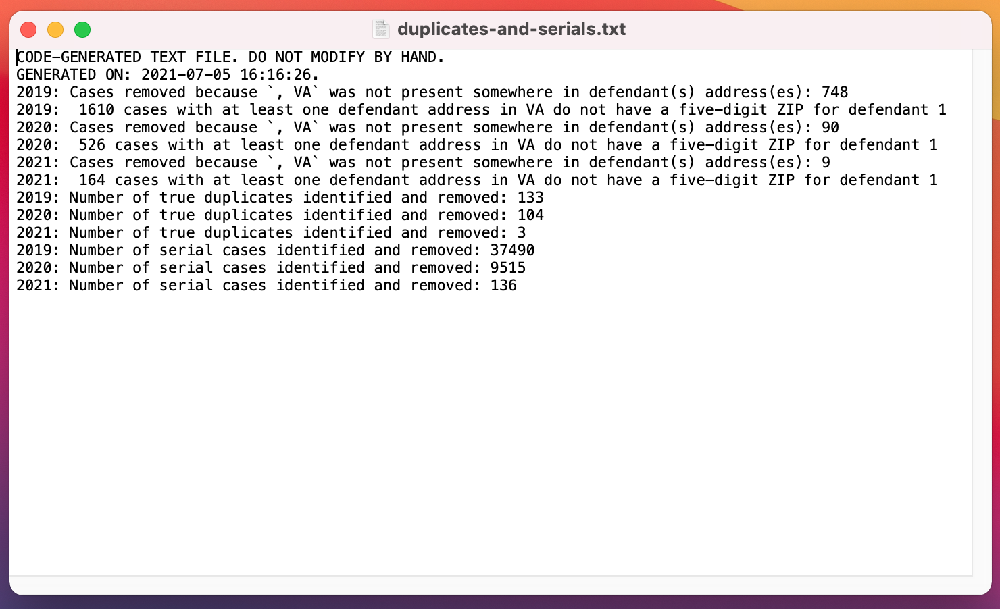

```{r setup, include=FALSE}
knitr::opts_chunk$set(echo = TRUE)
library(xfun)
```

Below is an overview of what I've been working on this past week.

---

[1.] I expanded the regex pattern that we'll use to identify non-residential defendants in eviction cases by a fairly significant amount. I think that we're now covering a great deal of ground in terms of flagging commercial/government/non-profit/etc. defendants. We received code from the Princeton Eviction Lab showing part of their search, and I integrated a number of their patterns into our regex. Michele also shared an article from the Urban Institute in which they tried to identify certain classes of entities in administrative data, and I pulled from their code to expand our search pattern. I've got a few more terms to add that I've landed on as I've looked through our data and continued to think on the matter, but I think that, overall, we're in decent shape regex-wise. Like last week, the current regex pattern is included the bottom of this file.

---

[2.] I got VA ZCTA and VA locality shapefiles (.shps and .RDSs) from tigris and generated some test maps. Our data reflect different spatial units than the data for a number of this summer's projects: The data are delineated by ZIP code and by court jurisdiction. Getting polygons for ZIP codes (technically, Zip Code Tabulation Areas, ZCTAs) was straightforward enough. Finding a way to map jurisdictional boundaries will take a bit more thinking. Unfortunately, there isn't an accessible shapefile (that we know of) that captures district court boundaries.

---

[3.] As a quality-of-life improvement for present and future users of our code for cleaning and aggregating eviction case data, I added code that generates a text file whenever the script is run that reports time-stamped info about the cleaning process, including the number of true duplicates and serial cases found for each year, as well as some info relevant to the issue outlined in [5.] below. An example of the .txt generated is at the bottom of this file.

---

[4.] I got an initial script together that generates by-ZIP and by-locality summary CSVs of our eviction data. Each year's CSV contains the number of cases, number of evictions, and number of default judgments for each spatial unit. **Note:** These numbers are due to change once we resolve the issue outlined below in [5.] regarding non-VA addresses in the data. I've set this script up so that, like the cleaning and aggregation script, no code changes need to be made as additional years of data are added. All we'll need to do is drop additional data folders into the script directory, run the cleaning/aggregation script, and then run the summarizing script. The latter will conclude by spitting out by-ZIP and by-locality CSVs.

---

[5.] I discovered a data issue that we may need to discuss with the VCU group. There are a number of cases in each year for which *no defendant has a VA address listed.*

For example, the concatenated defendant addresses for a two-defendant case might be:

`def_address = ‘MORRISTOWN, NJ 12345 | EWING, NJ 12345’`

When this occurs, it usually seems like like the *plaintiff* has a VA address. Accordingly, the case is associated with a VA court (e.g., "Richmond District Civil"). However: It's unclear where exactly the filed-against property is. Could it be possible for a plaintiff who lives in XXX, VA, to file a case in a Virginia court on behalf of a property that they own in YYY, NJ? I don't currently know.

So far, I'm finding that there are 748 cases in 2019 in which no defendant has a VA address, 90 cases in 2020 in which no defendant has a VA address, and 9 cases in 2021 in which no defendant has a VA address.

I don't currently know exactly what to do with these cases. I've been opting to drop them---but this may be the wrong approach.

Further: There are a number of cases where (a) at least one defendant has a VA address, but (b) defendant 1 does not have an associated ZIP code listed. E.g., the defendant addresses for a two-defendant case might look like this when concatenated together:

`def_address = ‘HENRICO, VA | ALTAVISTA, VA’`

or

`def_address = ‘HENRICO, VA | SAN ANTONIO, TX’`

or

`def_address = ‘HENRICO, VA | NEW YORK, NY 12345’`

Such cases are currently kept in the data (because there's >= 1 defendant with a VA address), but defendant 1 doesn't have an associated ZIP code that we can use when summarizing data by spatial units.

It seems like an open question as to what exactly we do in these cases: As far as I can tell, the VCU group hasn't done anything to address or identify the extent of this issue in the cleaning and analysis they've done so far.

##### Updated regex search pattern
```{R, echo = F, eval = T}
# Regex pattern for commercial/non-residential names
pattern <- paste0('(?i)', paste0(c('(\\bacadem(y|ics?)\\b)',
                                   '(\\badvis(ers?|ors?|ing)\\b)',
                                   '(\\bagenc(y|ies)\\b)',
                                   '(\\balum(nus|na|ni|nae)?\\b)',
                                   '(\\ba(merican?|p(artments?|parel))\\b)',
                                   '(\\bass(oc(iat(es?|ions?))?|n)\\.?\\b)',
                                   '(\\basylums?\\b)',
                                   '(\\bauto(motive)?s?\\b)',
                                   '(\\bbak(ers?|ery|ing)\\b)',
                                   '(\\bba(nk|ptist|rber(s|shops?)?)\\b)',
                                   '(\\bb(eauty|ible|onds)\\b)',
                                   '(\\bbook(s(tore|hop)?)?\\b)',
                                   '(\\bbraids?\\b)',
                                   '(\\bbuild(ings?|ers?)\\b)',
                                   '(\\bbu(reaus?|siness|y)\\b)',
                                   '(\\bcabinet(s|ry)\\b)',
                                   '(\\bca(rs?|fes?|tholic)\\b)',
                                   '(\\bc(ent(er|re)s?|i?(nemas?|ty))\\b)',
                                   '(\\bcl(ean(ers?|ing)|oth(es|ing))\\b)',
                                   '(\\bco(ffee|ll(ege|aboratives?)|mmunications?|mp(any|uters?)|un(cil|ty))\\b)',
                                   '(\\bcon(ditioning|s(truction|ult(ing|ants?)?)|tract(ing|ors?))\\b)',
                                   '(\\bco(\\-|\\s)?op(eratives?)?\\b)',
                                   '(\\bcorp(oration|\\.)?\\b)',
                                   '(\\bcredit\\b)',
                                   '(\\bcu(t(s|z)?|stoms?|isine)\\b)',
                                   '(\\bday(\\s{1})?care\\b)',
                                   '(\\bdecorat(ing|ors?)\\b)',
                                   '(\\bde(ntist(s|ry)?|sign(s|ing)?|lis?)\\b)',
                                   '(\\bd(octors?|iscounts?)\\b)',
                                   '(\\beater(y|ies)\\b)',
                                   '(\\be(lectricians?|n(terprises?|vironmental)|qui(pment|t(ies|y))|ye)\\b)',
                                   '(\\bfactor(y|ies)\\b)',
                                   '(\\bf(i(nanc(es?|i(al|ng))|rm)|e(dera(l|tions?)|llowships?))\\b)',
                                   '(\\bf(lorists?|oundation|u(n(ding|erals?)|rniture))\\b)',
                                   '(\\bg(allery|ifts?|lobal|r(ill(s|ing)?|oups?))\\b)',
                                   '(\\bhair(cut(s|ters?)?)?\\b)',
                                   '(\\bhea(lth(care)?|ting)\\b)',
                                   '(\\bh(istorical|o(ldings?|tels?|using))\\b)',
                                   '(\\binc(\\.|orporated)?\\b)',
                                   '(\\bin(dustr(ies|y)|st(allers?|itution(s|al)?)|ter(net|iors?)|vest(ing|ments?))\\b)',
                                   '(\\bislamic\\b)',
                                   '(\\bjerusalem\\b)',
                                   '(\\bjew(el(ry|ers?)|ish)\\b)',
                                   '(\\bla(bor(ers?)?|ndscap(e(rs?)?|ing)|undr(omat|y)|wn)\\b)',
                                   '(\\bli(quors?|mited)\\b)',
                                   '(\\bl(lc|td|l{0,2}?p)\\.?\\b)',
                                   '(\\bl(oan(s|z)?|u(theran|xury))\\b)',
                                   '(\\bmalls?\\b)',
                                   '(\\bm(ana)?g(e)?m(en)?t\\.?\\b)',
                                   '(\\bmanufactur(ers?|ing)\\b)',
                                   '(\\bma(ssage|rkets?)\\b)',
                                   '(\\bme(chanics?|dical|t(hodist|ro(politan)?))\\b)',
                                   '(\\bminist(ers?|ry|ries)\\b)',
                                   '(\\bmo(rtgages?|sque|t(els?|ors?))\\b)',
                                   '(\\bmu(nicipal(ity)?|sic(ians?)?)\\b)',
                                   '(\\bnat(iona)?l\\b)',
                                   '(\\bnetwork(s|ing)?\\b)',
                                   '(\\bno(n(\\-|\\s)?profit|odles?)\\b)',
                                   '(\\bnursing\\b)',
                                   '(\\boffices?\\b)',
                                   '(\\boptic(al|ians?)\\b)',
                                   '(\\borganizations?\\b)',
                                   '(\\borthodonti(sts?|cs)\\b)',
                                   '(\\bowners?\\b)',
                                   '(\\bpaint(ers|ings?)?\\b)',
                                   '(\\bpayday\\b)',
                                   '(\\bpentecostal\\b)',
                                   '(\\bpet(s|smart)?\\b)',
                                   '(\\bpizza\\b)',
                                   '(\\bp(artners?|l(aza|umb(ers?|ing))|ortfolios?)\\b)',
                                   '(\\bpr(e(mier|sbyterian)|operty)\\b)',
                                   '(\\bpublic\\b)',
                                   '(\\breal(t(y|ors?)| estate)\\b)',
                                   '(\\bre(pairs?|staurants?|tail(ers?)?)\\b)',
                                   '(\\bsaloo?ns?\\b)',
                                   '(\\bs(chool|ervices?|eafood)\\b)',
                                   '(\\bshop(s|pe)?\\b)',
                                   '(\\bshowrooms?\\b)',
                                   '(\\bso(ciety|lutions?)\\b)',
                                   '(\\bsp(a|ecialists?|ort(s|ing)?)\\b)',
                                   '(\\bsta(ff(ing|ers?)?|te)\\b)',
                                   '(\\bstudios?\\b)',
                                   '(\\bsu(ppl(ies|y)|r(g(e(ons?|ry)|ical)|plus))\\b)',
                                   '(\\bsy(stems?|nagogue)\\b)',
                                   '(\\bta(bernacle|nning)\\b)',
                                   '(\\btheat(er|re)\\b)',
                                   '(\\btires?\\b)',
                                   '(\\bto(ys?|wing)\\b)',
                                   '(\\btr(ading|u(ck(ers?|ing)|st))\\b)',
                                   '(\\bu(niversity|rban)\\b)',
                                   '(\\bvehicles?\\b)',
                                   '(\\bwarehous(es?|ing)\\b)',
                                   '(\\bw(elln|irel)ess\\b)',
                                   '(\\bwreck(ing|ers?)\\b)',
                                   '(\\by(mca|outh)\\b)',
                                   '(\\d+)'),
                                 collapse = '|')
                  )
pattern
```

##### Example of the summary text file generated by the cleaning/aggregation script
{width=75%}