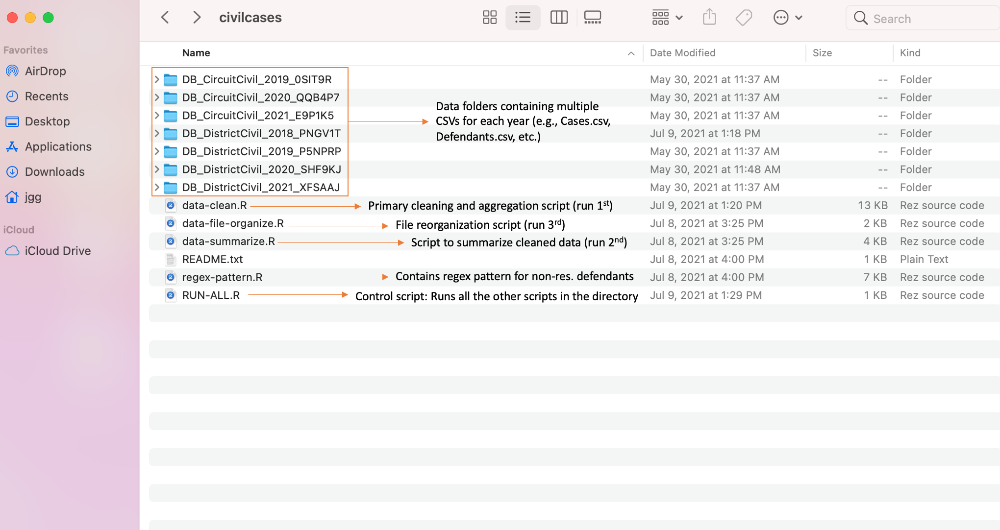

```{r setup, include=FALSE}
knitr::opts_chunk$set(echo = TRUE)
library(xfun)
```

Below is an overview of what I've been working on this past week.

---

[1.] I put a Markdown file together for our VCU collaborators updating them as to what all we've been doing on the data + code side of things this last month. It includes a breakdown of our cleaning and analysis process, tables containing by-court summaries of evictions across the years of data we have, maps displaying by-ZIP numbers, and an appendix with code for the curious.

---

[2.] One of my aims with the code for this project has been to keep things as automated as possible: At some point, someone else may well want to use these scripts---and potentially with different/new data. To that end, I prepared a "control" script that sequentially runs all of the other code involved in cleaning and analyzing the data. The scripts can, if desired, all be run separately---there may well be times when someone wants to deal with just one section of code or generate just one small chunk of output---but there's now the smooth-sailing option to run everything and generate all of the output files completely hands off.

That is, we begin with the following directory state. (The oddly named folders each contain a year's worth of district or circuit eviction data in the form of several "child" CSVs.)

{width=70%}

We then run "RUN-ALL.R"---the "control" script---and we automatically end up with the following:

{width=70%}

---

[3.] The scripts we use for cleaning and analyzing the eviction data end up generating a lot of exported files: Six CSVs for each year of data (e.g., we currently have four years of data, so the code returns 24 CSVs). To keep things organized, I wrote a script that creates some directories and moves files around (below). It's called as the final step of the RUN-ALL.R script referenced above.

```{r, echo = T, eval = F}
# Libraries
library(stringi)

# Checks
if (stri_detect(getwd(), regex = '(\\/civilcases$)') == F) {
  stop('civilcases is not the working directory')
}

# Create directories
yearly_cases_dir <- 'csvs-yearly-cases'
yearly_summaries_dir <- 'csvs-yearly-summaries'
dir.create(yearly_cases_dir)
dir.create(yearly_summaries_dir)

# Identify files to be moved
cleaned_cases <- dir()[stri_detect(dir(), regex = '(cases20(\\d{2})((\\_)residential_only)?(\\.csv))')]
cleaned_summaries <- dir()[stri_detect(dir(), regex = '(\\_)by')]

# Functions for moving files
cases_mover <- function(x) {
  file.copy(from = x, to = paste0(yearly_cases_dir, '/', x))
  file.remove(x)
}
summaries_mover <- function(x) {
  file.copy(from = x, to = paste0(yearly_summaries_dir, '/', x))
  file.remove(x)
}

# Move
sapply(cleaned_cases, FUN = cases_mover)
sapply(cleaned_summaries, FUN = summaries_mover)
```

---

[4.] Last week, one of the remaining issues to work out in our data cleaning process was how to handle eviction cases for which (a) not ZIP code was indicated or (b) the ZIP code indicated was not a valid Virginia ZIP. After last week's meeting, Michele and I settled on a strategy for handling those cases, so I implemented that in our code.

---

[5.] One of my concerns in developing these scripts has been ensuring that they would all continue to work automatically if/when we introduced additional years worth of eviction data. I wrote the code so that they theoretically should seamlessly integrate additional data into the cleaning, analyzing, and exporting process, but I had yet to test that assumption. This past week, we added data for another year of court cases (2018) and gave it a shot. Fortunately, it all worked. All one needs to do to introduce additional years of court cases is drop the data into the code directory and run the scripts again.