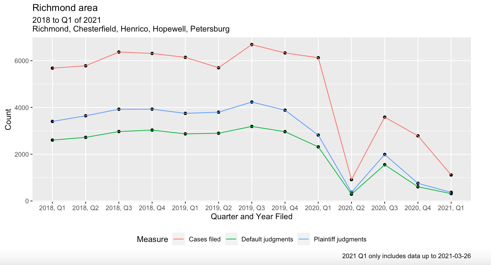

```{r setup, include=FALSE}
knitr::opts_chunk$set(echo = TRUE)
library(dplyr)
```

Below is an overview of what I've been working on this past week.

---

[1.] We've been working on interactive tables for displaying results from the eviction analysis. Currently, the primary scripts that clean and summarize the data are set up to call a separate Rmd file that generates an HTML containing the tables. I updated the Rmd to do a few things: (a) Identify for which years we have complete data (i.e., four quarters' worth) and compute %-changes across those years, where a table for each pair of sequential complete-data years is contained in its own tab; (b) dynamically generate a variable number of tabs based on the aforementioned determination. The code for doing (b) is below:

- I take an object called `list_dfs_all`, which is of variable length and contains all of the data frames I want to generate tables (and tabs) for
- I sequence along the length of `list_dfs_all`, each time using `knit_expand(text = ...)` calls to generate a few lines of Markdown-interpretable text, including an unevaluated statement applying a function I wrote called `tabler()` (which creates the interactive tables) to the corresponding element of `list_dfs_all`; the cumulative output is saved the an object called `out_all`
- Once that process is complete, I use an inline statement---see the commented-out line at the bottom of the code block---to evaluate the output as a combination of raw Markdown text and R code, with the Markdown text formatted such that each table will be dropped into a new, dynamically determined tab

```{r, echo = T, eval = F}
out_all <- lapply(seq_along(list_dfs_all), 
              function(i) {
                # tab headers
                tab_headers <- knitr::knit_expand(text = sprintf("### %s\n", gsub('\\.', ' to ', full_years_combos_all)[i]))
                # start r chunk
                start_r_chunks <- knitr::knit_expand(text = "\n```{r, echo = F, eval = T}") 
                # get tables by "writing" out `tabler(list_dfs_for_tabs[[1]]` etc. to be rendered later
                table_calls_all <- knitr::knit_expand(text = sprintf("\ntabler(list_dfs_all[[%d]])", i))
                # end r chunk
                finish_r_chunks <- knitr::knit_expand(text = "\n```\n")
                # collapse together all lines with newline separator
                paste(tab_headers, start_r_chunks, table_calls_all, finish_r_chunks, collapse = '\n')
                }
              )

# `r paste(knitr::knit(text = paste(out_all, collapse = '\n')))`
```

---

[2.] I've begun work on a write-up for the housing justice advisory committee displaying some key eviction data for the Charlottesville and Richmond regions. I've been finalizing plots first; prose will be filled in around them. Currently, we've got by-year and by-quarter plots, and by-ZIP maps are in progress (I'm working on a way to overlap ZIP polygons with locality polylines to make regional distinctions obvious even when mapping by-ZIP data). An example of a by-quarter plot is below (Richmond region):

{width=75%}

---

[3.] I've begun developing code files for the TJPDC grant Michele recently received to develop an evictions database for Charlottesville and Albemarle. We're able to reuse a lot of the code I've previously written for the "main" evictions project, but there's a bit of bespoke work to be done (e.g., looking into the presence/absence of defense attorneys)