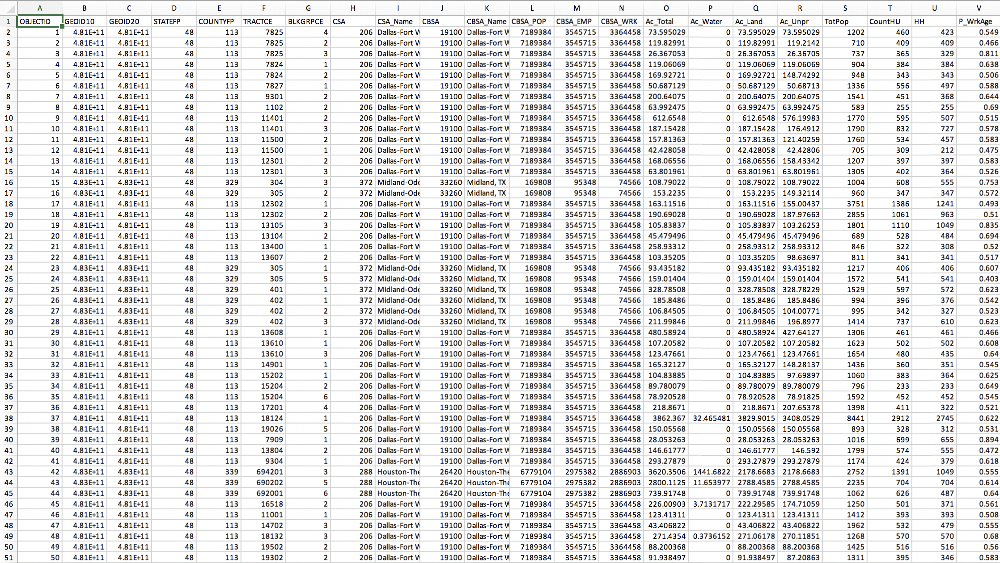
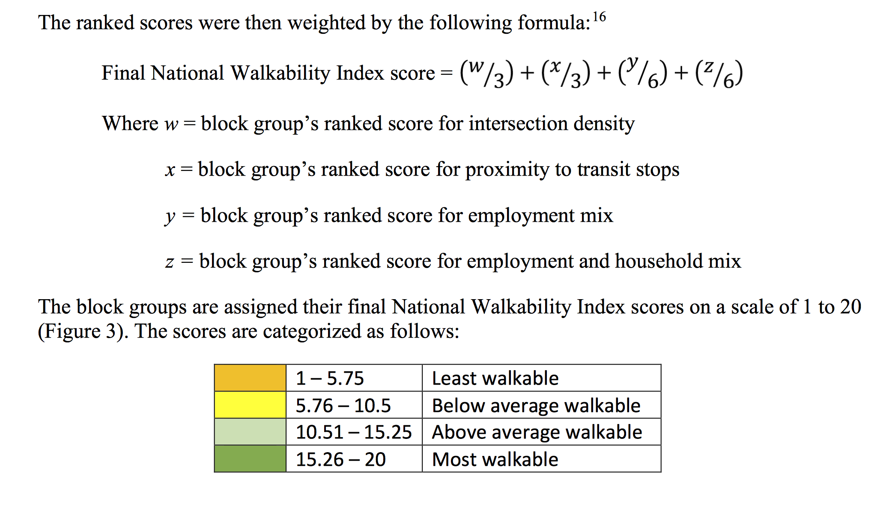

```{r setup, include=FALSE}
knitr::opts_chunk$set(echo = TRUE)
```
Data Source: https://www.epa.gov/smartgrowth/smart-location-mapping#walkability

More Information on Dataset: https://www.epa.gov/sites/default/files/2021-06/documents/national_walkability_index_methodology_and_user_guide_june2021.pdf


A large body of research has demonstrated that land use and urban form can have a significant effect on transportation outcomes. The EPA developed three data products that consistently measure the built environment and transit accessibility of neighborhoods across metropolitan regions and across the United States. Each product summarizes the characteristics of census block groups. Users can download data, browse the data in interactive maps, or access the data through web services.

For this project, the original data source came in a csv format. I ran analyses on the data, while merging it with spatial data retrieved from external sources, to then build interactive maps for each spatial unit. The user can click on various locations around Charlottesville and the Easternshore region to look at the walkability of those areas.


# National Walkability Index

The National Walkability Index is a nationwide geographic data resource that ranks block groups according to their relative walkability. The Index is based on measures of the built environment that affect the probability of whether people walk as a mode of transportation: street intersection density, proximity to transit stops, and diversity of land uses.

The dataset includes walkability scores for all block groups as well as the underlying attributes that are used to rank the block groups. The walkability scores are calculated based on a simple formula that ranks selected indicators from the Smart Location Database that have been demonstrated to affect the propensity of walk trips. 

Currently, the National Walkability Index dataset ranks each block group relative to all other block groups in the United States, but individuals can use downloadable data and the "how-to" document to construct an index for a smaller universe of block groups, like a state, metropolitan area, or city.

# Original Data



This is what the original dataset looked like before modification. In a seperate generative file, I filtered out the most important variables that contributed to the calculations of the Walkability Index for the regions of interest (Albemarle, Fluvanna, Greene, Louisa, Nelson Counties, and Charlottesville city). The variables used in the analysis are listed below along with their descriptions.

# Variable Description 

* D3B [Street intersection density (pedestrian-oriented intersections). Higher intersection density is correlated with more walk trips.]

* D4A [Predicted commute mode split - proportion of workers in the block group who carpool. (replaced -99999.00 with NA)]

* D2B_E8MIXA [The mix of employment types in a block group (such as retail, office, or industrial). Higher values correlate with more walk trips.]

* D2A_EPHHM [The mix of employment types and occupied housing. A block group with a diverse set of employment types (such as office, retail, and service) plus a large quantity of occupied housing units will have a relatively high value. Higher values correlate with more walk trips.]

* D2A_Ranked [Resulting rank of block group for D2A_EPHHM within all block groups. Range from 1-20, higher ranks indicate more walk trip likelihood.]

* D2B_Ranked [Resulting rank of block group for D2B_E8MIXA within all block groups. Range from 1-20, higher ranks indicate more walk trip likelihood.] 

* D3B_Ranked [Resulting rank of block group for D3B within all block groups. Range from 1-20, higher ranks indicate more walk trip likelihood.]

* D4A_Ranked [Resulting rank of block group for D4A within all block groups. Range from 1-20, higher ranks indicate more walk trip likelihood.]

* NatWalkInd  [National Walkability Index score. Calculated by weighted formula using results of indicator rank scores.]



EPA's "National Walkability Index Methodology and User Guide" explains how the Walkability Scores were calculated. The scores are then divided into 4 categories, which I utilized later in the Walkability Maps to showcase the % of Tracts/Blockgroups within the larger spatial units. 


```{r, message=F, warning=F}
library(tidyverse)
library(knitr)
library(ggplot2)
library(stargazer)
library(tidycensus)
library(stringr)
library(sf)
library(leaflet)
cville_walkability <- read.csv("cville_walk.csv")
east_blkgps <- readRDS("Easternshore_Tree/eastshore_blkgps.RDS")
cville_blkgps <- readRDS("Cville_Tree/cville_blkgps.RDS")
cvillefips <- c("540", "003", "065", "079", "109", "125", "001", "131")
```

```{r, include=F}
spatial <- rbind(cville_blkgps, east_blkgps)

cville_walkability$COUNTYFP <- cville_walkability$COUNTYFP%>%
  str_pad(3, pad = "0")
cville_walkability$TRACTCE <- cville_walkability$TRACTCE%>%
  str_pad(6, pad = "0")


cville_walk <- merge(x = spatial, y = cville_walkability, by=c("TRACTCE", "BLKGRPCE"))%>%
  select(-c(STATEFP.y, COUNTYFP.y, MTFCC, FUNCSTAT, INTPTLAT, INTPTLON,GEOID10, GEOID20))

st_crs(cville_walk) <- 4326
cville_walk <- st_transform(cville_walk, crs = 4326)

cville_walk$NatWalkInd <- round(cville_walk$NatWalkInd, 3)
colnames(cville_walk)[4] <- "COUNTYFP"

cville_walk$COUNTYFP <- cville_walk$COUNTYFP%>%
  str_pad(3, pad = "0")
cville_walk$TRACTCE <- cville_walk$TRACTCE%>%
  str_pad(6, pad = "0")


# smart location database: https://www.epa.gov/smartgrowth/smart-location-mapping#SLD
```


# Analysis {.tabset}
National Walkability Index score. Calculated by weighted formula using results of indicator rank scores.


## County {.tabset}

### Bar Graph of Walkability Scores
This series of bargraphs showcase the Walkability Scores for individual Tracts within each County.
```{r, message=F, warning=F}
cville_walk%>%
  ggplot(aes(x = NatWalkInd)) + 
    geom_histogram() + 
    facet_wrap(~COUNTYFP)+
    theme(strip.background = element_blank())
```


### Mean National Walkability Index
Collapsing the previously shown bargraph into a simple comparison of mean Walkability Scores for each County. 
```{r, message=F, warning=F}

i = cville_walk$COUNTYFP
means = c()
for ( i in cvillefips){
  means[[i]] <- cville_walk %>%
    filter(COUNTYFP ==i)%>%
    ungroup()%>%
    select(NatWalkInd)%>%
  st_drop_geometry()%>%
  unlist()%>%
  as.numeric()%>%
      mean()%>%
    round(3)
  means <- as.data.frame(means)
}
```

```{r, include=F}
colnames(means)[1] <- "540"
rownames(means) <- "Mean_NatWalkInd"
```

```{r, warning=F, message=F, echo=F}
kable(means, format = "markdown")
means_bar <- as.matrix(means)
barplot(means_bar, main= "Mean National Walkability Index by County", xlab= "County", ylab=" Mean Walkability Index")
```


### Summary Statistics
```{r, warning=F, message=F, echo=F}
i = cville_walk$COUNTYFP
sum = c()
for (i in cvillefips){
  sum[[i]]<-cville_walk %>% 
    filter(COUNTYFP==i)%>%
    select(D3B:NatWalkInd) %>% 
    select(where(~is.numeric(.x)))
  
  sum[[i]] %>% 
    as.data.frame() %>% 
    stargazer(., type = "text", title = paste("Summary Statistics",i), digits = 2,
            summary.stat = c("mean", "sd", "min", "median", "max"))
}

```

### Walkability Map
I categorized the Walkability Scores into 4 categories based on EPA's "National Walkability Index
Methodology and User Guide" 
When clicking on a County, the map shows the % of Tracts in each of the 4 walkability categories. 

Source: https://www.epa.gov/sites/default/files/2021-06/documents/national_walkability_index_methodology_and_user_guide_june2021.pdf

```{r, message=F, warning=F, include=F}

County_map <- cville_walk%>%
  group_by(TRACTCE, COUNTYFP)%>%
  dplyr::summarise(sum_mean = round(mean(NatWalkInd),3))%>%
    st_drop_geometry()%>%
  as.data.frame()


County_map2 <- cville_walk%>%
  group_by(COUNTYFP)%>%
  dplyr::summarise(sum_mean = round(mean(NatWalkInd),3))%>%
    st_drop_geometry()
###
cville_county <- readRDS("Cville_Tree/cville_counties.RDS")
east_county <- readRDS("Easternshore_Tree/eastshore_counties.RDS")
spatial_county <- rbind(cville_county, east_county)
walk_county <- merge(x = spatial_county, y = County_map2, by=c("COUNTYFP"))%>%
  select(-c(STATEFP,  MTFCC, FUNCSTAT, INTPTLAT, INTPTLON, NAME, ALAND,AWATER,COUNTYNS, LSAD,CLASSFP,CSAFP,CBSAFP,METDIVFP,sum_mean))
st_crs(walk_county) <- 4326
walk_county <- st_transform(walk_county, crs = 4326)
```


```{r, message=F, warning=F, include=F}
x=County_map$sum_mean
County_map <- County_map%>%
  dplyr::mutate(C= case_when(
    sum_mean <5.76 ~ "Least Walkable",
    sum_mean < 10.51 ~ "Below Average Walkable",
    sum_mean < 15.26 ~ "Above Average Walkable",
    sum_mean <= 20 ~ "Most Walkable",
    TRUE ~ as.character(x)
))

```

```{r, include=F}

County_map <- County_map%>%
  mutate("Most_walkable" = case_when(
  County_map$C == "Most Walkable" ~ 1,
  County_map$C != "Most Walkable" ~ 0
))

County_map <- County_map%>%
  mutate("Above_average_walkable" = case_when(
  County_map$C == "Above Average Walkable" ~ 1,
  County_map$C != "Above Average Walkable" ~ 0
))

County_map <- County_map%>%
  mutate("Below_average_walkable" = case_when(
  County_map$C == "Below Average Walkable" ~ 1,
  County_map$C != "Below Average Walkable" ~ 0
))

County_map <- County_map%>%
  mutate("Least_walkable" = case_when(
  County_map$C == "Least Walkable" ~ 1,
  County_map$C != "Least Walkable" ~ 0
))
```


```{r, message=F, warning=F, include=F}
  
COUNTY_freq <- County_map%>%
  group_by(COUNTYFP)%>%
  dplyr::summarise(sum_most = sum(Most_walkable),sum_above = sum(Above_average_walkable), sum_below = sum(Below_average_walkable), sum_least = sum(Least_walkable), num_tracts = n())%>%
  mutate(most_proc = (sum_most/num_tracts)* 100, above_proc = (sum_above/num_tracts)* 100, below_proc = (sum_below/num_tracts)* 100, least_proc = (sum_least/num_tracts)* 100)%>%
  mutate(most_proc=round(most_proc,3), above_proc=round(above_proc,3), below_proc=round(below_proc,3), least_proc=round(least_proc,3))%>%
  select(-c(sum_most, sum_above, sum_below, sum_least, num_tracts))

COUNTY_freq <- merge(x = COUNTY_freq, y = County_map2, by=c("COUNTYFP"))
COUNTY_freq <- merge(x = COUNTY_freq, y = walk_county, by=c("COUNTYFP"))
```


```{r, message=F, warning=F}
pal <- colorNumeric("plasma", reverse = TRUE, domain = COUNTY_freq$sum_mean)
#COUNTY_freq <- spTransform(COUNTY_freq, CRS("+init=epsg:4326"))
COUNTY_freq <- st_as_sf(COUNTY_freq)
st_crs(COUNTY_freq) <- 4326
COUNTY_freq <- st_transform(COUNTY_freq, crs = 4326)
m <- leaflet()%>%
  addTiles()%>%
  addPolygons(data = COUNTY_freq,
              #lat = test$lat,
              #lng = test$lng,
              fillColor = ~pal(sum_mean),
              weight = 1,
              opacity = 1,
              color = "white",
              fillOpacity = 0.6,
              highlight = highlightOptions(weight = 2, fillOpacity = 0.8, bringToFront = T),
              popup = paste0(#"FIPS Code: ", Freq$GEOID, "<br>"))
                             "Ave. NatWalkind: ", COUNTY_freq$sum_mean, "<br>",
              "Most Walkable: ", COUNTY_freq$most_proc, "% of tracts", "<br>",
"Above Average Walkable: ", COUNTY_freq$above_proc, "% of tracts", "<br>",
"Below Average Walkable: ", COUNTY_freq$below_proc, "% of tracts", "<br>",
"Least Walkable: ", COUNTY_freq$least_proc, "% of tracts"))%>%
  addLegend("bottomright", pal = pal, values = COUNTY_freq$sum_mean,
            title = "Walkability", opacity = 0.7)
m
```


## Tract {.tabset}

### Bar Graph of Walkability Scores
Graph of Walkability Scores for all Blockgroups within each Tract
```{r, message=F, warning=F}
cville_walk%>%
  ggplot(aes(x = NatWalkInd)) + 
    geom_histogram() + 
    facet_wrap(~TRACTCE)+
    theme(strip.background = element_blank())

```


```{r, message=F, warning=F, include=F}
x=cville_walk$NatWalkInd
Freq <- cville_walk%>%
  mutate(C = case_when(
    cville_walk$NatWalkInd <5.76 ~ "Least Walkable",
    cville_walk$NatWalkInd < 10.51 ~ "Below Average Walkable",
    cville_walk$NatWalkInd < 15.26 ~ "Above Average Walkable",
    cville_walk$NatWalkInd <= 20 ~ "Most Walkable",
    TRUE ~ as.character(x)
))
```

### Mean National Walkability Index 
```{r, warning=F, message=F}

tract <- as.list(cville_walk$TRACTCE)
i = Freq$TRACTCE
means = c()
for ( i in tract){
  means[[i]] <- Freq %>%
    filter(TRACTCE ==i)%>%
    ungroup()%>%
    select(NatWalkInd)%>%
  st_drop_geometry()%>%
  unlist()%>%
  as.numeric()%>%
      mean()%>%
    round(3)
  means <- as.data.frame(means)
}
```

```{r, include=F}
colnames(means)[1] <- "000201"
rownames(means) <- "Mean_NatWalkInd"
means <- as.matrix(means)
```

```{r, warning=F, message=F, echo=F}
kable(means, format = "markdown")

barplot(means, main= "Mean National Walkability Index by County", xlab= "County", ylab=" Mean Walkability Index", las=2, cex.names=0.7)

#xlab angle
```


```{r, message=F, warning=F, include=F}

Tract_map <- cville_walk%>%
  group_by(TRACTCE, BLKGRPCE)%>%
  dplyr::summarise(sum_mean = round(mean(NatWalkInd),3))%>%
    st_drop_geometry()%>%
  as.data.frame()


Tract_map2 <- cville_walk%>%
  group_by(TRACTCE)%>%
  dplyr::summarise(sum_mean = round(mean(NatWalkInd),3))
```


### Summary Statistics
```{r, warning=F, message=F, echo=F}
i = cville_walk$TRACTCE
sum = c()
for (i in tract){
  sum[[i]]<-cville_walk %>% 
    filter(TRACTCE==i)%>%
    select(D3B:NatWalkInd) %>% 
    select(where(~is.numeric(.x)))
  
  sum[[i]] %>% 
    as.data.frame() %>% 
    stargazer(., type = "text", title = paste("Summary Statistics",i), digits = 2,
            summary.stat = c("mean", "sd", "min", "median", "max"))
}

```

### Walkability Map 
When clicking on a Tract, the map shows the % of Blockgroups in each of the 4 walkability categories. 
```{r, message=F, warning=F, include=F}
x=Tract_map$sum_mean
Tract_map <- Tract_map%>%
  dplyr::mutate(C= case_when(
    sum_mean <5.76 ~ "Least Walkable",
    sum_mean < 10.51 ~ "Below Average Walkable",
    sum_mean < 15.26 ~ "Above Average Walkable",
    sum_mean <= 20 ~ "Most Walkable",
    TRUE ~ as.character(x)
))

```

```{r, include=F}

Tract_map <- Tract_map%>%
  mutate("Most_walkable" = case_when(
  Tract_map$C == "Most Walkable" ~ 1,
  Tract_map$C != "Most Walkable" ~ 0
))

Tract_map <- Tract_map%>%
  mutate("Above_average_walkable" = case_when(
  Tract_map$C == "Above Average Walkable" ~ 1,
  Tract_map$C != "Above Average Walkable" ~ 0
))

Tract_map <- Tract_map%>%
  mutate("Below_average_walkable" = case_when(
  Tract_map$C == "Below Average Walkable" ~ 1,
  Tract_map$C != "Below Average Walkable" ~ 0
))

Tract_map <- Tract_map%>%
  mutate("Least_walkable" = case_when(
  Tract_map$C == "Least Walkable" ~ 1,
  Tract_map$C != "Least Walkable" ~ 0
))
```


```{r, message=F, warning=F, include=F}
  
Tract_freq <- Tract_map%>%
  group_by(TRACTCE)%>%
  dplyr::summarise(sum_most = sum(Most_walkable),sum_above = sum(Above_average_walkable), sum_below = sum(Below_average_walkable), sum_least = sum(Least_walkable), num_tracts = n())%>%
  mutate(most_proc = (sum_most/num_tracts)* 100, above_proc = (sum_above/num_tracts)* 100, below_proc = (sum_below/num_tracts)* 100, least_proc = (sum_least/num_tracts)* 100)%>%
  mutate(most_proc=round(most_proc,3), above_proc=round(above_proc,3), below_proc=round(below_proc,3), least_proc=round(least_proc,3))%>%
  select(-c(sum_most, sum_above, sum_below, sum_least, num_tracts))

Tract_freq <- merge(x = Tract_freq, y = Tract_map2, by=c("TRACTCE"))
```

```{r, message=F, warning=F}
pal <- colorNumeric("plasma", reverse = TRUE, domain = Tract_freq$sum_mean)

Tract_freq <- st_as_sf(Tract_freq)
st_crs(Tract_freq) <- 4326
Tract_freq <- st_transform(Tract_freq, crs = 4326)
m <- leaflet()%>%
  addTiles()%>%
  addPolygons(data = Tract_freq,
              #lat = test$lat,
              #lng = test$lng,
              fillColor = ~pal(sum_mean),
              weight = 1,
              opacity = 1,
              color = "white",
              fillOpacity = 0.6,
              highlight = highlightOptions(weight = 2, fillOpacity = 0.8, bringToFront = T),
              popup = paste0(#"FIPS Code: ", Freq$GEOID, "<br>"))
                             "Ave. NatWalkind: ", Tract_freq$sum_mean, "<br>",
              "Most Walkable: ", Tract_freq$most_proc, "% of blockgroups", "<br>",
"Above Average Walkable: ", Tract_freq$above_proc, "% of blockgroups", "<br>",
"Below Average Walkable: ", Tract_freq$below_proc, "% of blockgroups", "<br>",
"Least Walkable: ", Tract_freq$least_proc, "% of blockgroups"))%>%
  addLegend("bottomright", pal = pal, values = Tract_freq$sum_mean,
            title = "Walkability", opacity = 0.7)
m
```


## Block Groups {.tabset}
### Walkability Map

```{r, message=F, warning=F}
pal <- colorNumeric("plasma", reverse = TRUE, domain = Freq$NatWalkInd)
m <- leaflet()%>%
  addTiles()%>%
  addPolygons(data = Freq,
              #lat = test$lat,
              #lng = test$lng,
              fillColor = ~pal(NatWalkInd),
              weight = 1,
              opacity = 1,
              color = "white",
              fillOpacity = 0.6,
              highlight = highlightOptions(weight = 2, fillOpacity = 0.8, bringToFront = T),
              popup = paste0("Walkability: ", Freq$C, "<br>",
                             "NatWalkind: ", Freq$NatWalkInd))%>%
  addLegend("bottomright", pal = pal, values = Freq$NatWalkInd,
            title = "Walkability", opacity = 0.7)
m
```


